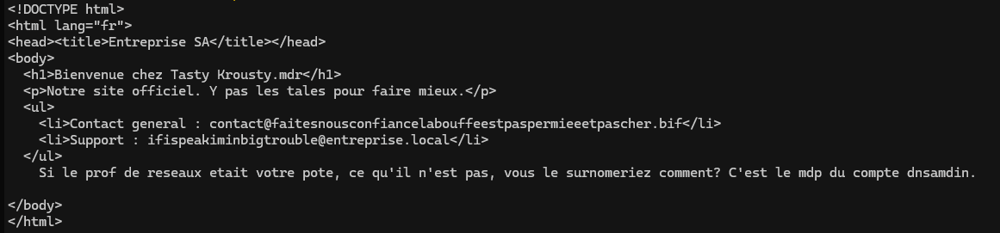

# Atelier **Pen Test** 

# Rapport d'Activité Red Team — Round 1

**Cible :** Infrastructure TastyCrousty

**Statut de l'objectif :** Échec (Bloqué par la Blue Team)


---

## 1. Synthèse Exécutive

Dans le cadre de cet exercice de simulation, notre équipe a opéré en tant que **Red Team**. L'objectif principal de ce premier round était de réaliser une attaque de type **DNS Poisoning** afin de détourner le flux réseau des employés de l'entreprise *TastyCrousty* vers un clone malveillant hébergé localement.

Malgré une phase de reconnaissance qui nous a permis de récupérer des données importantes qui nous ont permis d'identifier précisément le DNS, **l'attaque n'a pas pu être finalisée**. La Blue Team a réagi efficacement en amont en durcissant les règles du pare-feu externe/interne (`FW_ext` / `FW_int`) et en **bloquant complètement l'accès SSH vers le serveur DNS** à l'addresse ip _`10.0.10.53`_. Privés de point d'accès pour modifier les fichiers de la cible, nous avons été mis en échec sur cet objectif précis.

---

Voici un approfondissement détaillé de la **Partie 2 (Objectif de l'attaque)**, conçu pour être intégré directement dans votre rapport final. Cette section explique de manière chirurgicale la théorie de l'attaque, les prérequis techniques, la configuration de BIND, et l'impact escompté de la compromission.

---

## 2. Objectif théorique de l'attaque (DNS Poisoning)


### 2.1 Le mécanisme BIND et la gestion des privilèges

Le serveur DNS de l'entreprise (`ServerDNS` - `10.0.10.53`) utilise le démon **BIND 9** (`named`), le standard sous les systèmes de type Debian/Linux. L'attaque planifiée s'appuyait sur l'exploitation d'une configuration de privilèges spécifique et fréquente sur ce service :

* **Fichiers de configuration clés :** Le répertoire `/etc/bind/` héberge la déclaration des zones (`named.conf.local`) ainsi que les fichiers de base de données de zone (souvent nommés `db.<zone>`), qui contiennent l'ensemble des enregistrements.
* **La faiblesse des permissions :** Par défaut, pour permettre la gestion des zones sans exiger les privilèges de l'administrateur suprême (`root`), les fichiers de zone (ex: `/etc/bind/db.tastycrousty.local`) possèdent les attributs de propriété `root:bind` associés à des droits d'accès **`664`** (`rw-rw-r--`).
* **Point d'accès :** Cela signifie que n'importe quel utilisateur système appartenant au groupe **`bind`** dispose des droits d'écriture et de modification sur les enregistrements DNS. L'objectif de la Red Team était donc de compromettre un compte utilisateur membre de ce groupe (via l'accès SSH initialement prévu).

### 2.2 Déroulement technique de l'exploitation (Scénario Nominal)

Si l'accès SSH avait été maintenu par la Blue Team, la manipulation technique se serait articulée autour des quatre étapes suivantes :

1. **Altération de l'enregistrement A :** Édition du fichier de zone pour modifier l'adresse IP associée au serveur web principal ou à l'intranet de l'entreprise.
* *Configuration initiale :* `www  IN  A  10.0.10.80` (Pointe vers le vrai serveur `WEBServ`)
* *Configuration corrompue :* `www  IN  A  10.0.0.100` (Redirection vers la machine Kali de la Red Team)


2. **Incrémentation du Numéro de Série (Serial) :** Le protocole DNS s'appuie sur le champ *Serial* présent dans l'enregistrement SOA (Start of Authority) pour déterminer si une zone a été mise à jour. Pour que le démon BIND prenne en compte les modifications, ce numéro doit impérativement être incrémenté (par exemple, passer de `2026050401` à `2026050402`).
3. **Prise en compte par le démon :** Exécution de la commande d'administration `rndc reload` ou `systemctl reload named`. Grâce aux droits du groupe `bind`, le serveur recharge sa configuration instantanément sans interruption de service.


### 2.3 Impact attendu et scénario après attaque

Une fois l'empoisonnement DNS actif, l'impact sur l'organisation aurait été immédiat et critique :

* **Hébergement du Clone Web (Phishing) :** La Red Team avait déployé en local une copie conforme de l'interface d'authentification du site de *TastyCrousty*.
* **Interception transparente :** Lorsqu'un employé tente de naviguer sur `www.tastycrousty.local`, son poste interroge le serveur DNS légitime (`10.0.10.53`). Ce dernier lui répondait de se connecter à l'IP de la Red Team (`10.0.0.100`).
* **Vol de Identités et Identifiants :** L'employé, ne remarquant aucune alerte de sécurité (si le site utilise du HTTP ou si un certificat auto-signé est accepté), saisissait ses identifiants d'entreprise. Les scripts de capture de la Red Team enregistraient alors les identifiants, mots de passe et token de session en clair, ouvrant la voie à une compromission totale des comptes de l'entreprise.

---

## 3. Phase d'Observation et Reconnaissance

### Cartographie réseau initiale

D'après nos interfaces locales (`ip a`), notre machine d'attaque disposait d'un pied sur le réseau interne : `10.0.0.100/24` et `172.30.42.10/24`.

``` bash
$ ip a
1: lo: <LOOPBACK,UP,LOWER_UP> mtu 65536 qdisc noqueue state UNKNOWN group default qlen 1000
   link/loopback 00:00:00:00:00:00 brd 00:00:00:00:00:00
   inet 127.0.0.1/8 scope host lo
      valid_lft forever preferred_lft forever
   inet6 ::1/128 scope host noprefixroute 
      valid_lft forever preferred_lft forever
2: eth0: <BROADCAST,MULTICAST,UP,LOWER_UP> mtu 1500 qdisc fq_codel state UP group default qlen 1000
   link/ether 00:50:00:00:04:00 brd ff:ff:ff:ff:ff:ff
   inet 10.0.0.100/24 brd 10.0.0.255 scope global eth0
      valid_lft forever preferred_lft forever
   inet6 fe80::250:ff:fe00:400/64 scope link proto kernel_ll 
      valid_lft forever preferred_lft forever
3: eth1: <BROADCAST,MULTICAST,UP,LOWER_UP> mtu 1500 qdisc fq_codel state UP group default qlen 1000
   link/ether 00:50:00:00:04:01 brd ff:ff:ff:ff:ff:ff
   inet 172.30.42.10/24 brd 172.30.42.255 scope global dynamic noprefixroute eth1
      valid_lft 2424985sec preferred_lft 2100985sec
   inet6 fe80::e345:f53b:a77c:bac3/64 scope link 
      valid_lft forever preferred_lft forever
```

Pour contourner la vigilance des administrateurs et éviter les mécanismes de protection des pare-feux qui bloquent les scans agressifs (limites anti-flood, quotas de tables d'états), nous avons appliqué une philosophie de scan prudente (`-Pn`, parallélisme limité à 2 paquets simultanés).

### Résultats des Scans `nmap`

Les logs d'audit montrent l'exploration du sous-réseau DMZ `10.0.10.0/24` :

* 
**Passerelle / Pare-feu (`10.0.0.1`) :** Identifié comme un firewall **OPNsense**.


* **Serveur Web (`10.0.10.80` / `WEBServ`) :** Ports 22 (SSH) et 80 (HTTP) ouverts.
* **Serveur DNS (`10.0.10.53` / `ServerDNS`) :** Ports 22 (SSH) initialement ouvert mais fermé par la Blue Team, 53 ouvert.

Commande nous donnants les ports ouverts de certaines ips du sous-réseaux _10.0.10.0/24_: 

```bash
nmap -sS -sV -Pn -p 22,53,80,443 --max-retries 2 --max-parallelism 2 -T1 10.0.10.0/24
Starting Nmap 7.95 ( https://nmap.org/ ) at 2026-05-04 05:18 EDT
Nmap scan report for 172.30.0.0
Host is up.

Nmap scan report for 10.0.10.1
Host is up (0.00068s latency).

PORT    STATE    SERVICE
22/tcp  filtered ssh
53/tcp  open     domain
80/tcp  open     http
443/tcp filtered https

Nmap scan report for 10.0.10.2
Host is up (0.029s latency).

PORT    STATE    SERVICE
22/tcp  open     ssh
53/tcp  filtered domain
80/tcp  open     http
443/tcp filtered https

Nmap scan report for 10.0.10.53
Host is up (0.022s latency).

PORT    STATE  SERVICE
22/tcp  closed ssh
53/tcp  open   domain
80/tcp  closed http
443/tcp closed https

Nmap scan report for 10.0.10.80
Host is up (0.027s latency).

PORT    STATE  SERVICE
22/tcp  open   ssh
53/tcp  closed domain
80/tcp  open   http
443/tcp closed https
```

*Constat critique :* Le port **22/tcp (SSH) est détecté comme `closed` (fermé)** sur le serveur DNS. La Blue Team a coupé le flux SSH au niveau du firewall ou désactivé le service sur l'hôte, rendant impossible toute tentative d'authentification ou de brute-force via `hydra` (Outil de brute-force).

De plus en nous mettant en root sur la machine local Kali avec

```bash
sudo -i
```

Nous avons découvert un fichier _Dicodesfamilles.txt_ et une note nous disant d'aller regarder le répertoire _/tmp_, on a pu y trouvé une liste de mots de passe et d'utilisateurs.

Ensuite Antoine Vivien de Clermont a leak les mots de passe du serveur dns, un nouveau mdp a été implémenté, heuresement nous avions téléchargé ces fichiers sur nos machines hôtes avec la commande '_scp source destination_', nous avons pu utiliser une commande pour récupérer les changements

```bash 
diff dicodesfamilles.txt /tmp/passwds.txt
76d75
< stuckb2
91,92d89
< pichoupw
< pichoupw
```

Ensuite, avec ces deux commandes, on a eu accès au fichier _index.html_ du serveur Web: 

```bash
curl 10.0.10.80 (ou wget 10.0.10.80)
```


A partir de la, nous avons été bloqué car impossible de se connecter en ssh au serveur DNS.

---

## 4. Analyse et Alternatives techniques

### Ce qui aurait pu être fait pour contourner le blocage

Pour que l'attaque par empoisonnement DNS fonctionne malgré la coupure du SSH direct sur le DNS, plusieurs pivots ou techniques alternatives auraient pu être déployés :

1. **Pivotement via le Serveur Web (`10.0.10.80`) :**
Le serveur web possède le port SSH ouvert. Si nous avions réussi à compromettre ce serveur (par brute force `hydra`  ou exploitation d'une vulnérabilité applicative Web), nous aurions pu l'utiliser comme **rebond** (Pivot). Depuis ce serveur situé dans la même DMZ (`SW_DMZ`), les privilèges réseaux vers le DNS auraient pu être différents (accès SSH interne potentiellement autorisé entre machines de la DMZ).


2. **Attaque par usurpation ARP (ARP Spoofing) en LAN :**
Au lieu de modifier directement la configuration interne du serveur BIND, nous aurions pu intercepter le trafic à la racine via le protocole réseau local en utilisant des outils comme **Bettercap**. En configurant le module `arp.spoof`  pour cibler les postes clients, nous aurions pu nous positionner en "Man-in-the-Middle" (MitM) et intercepter/répondre nous-mêmes aux requêtes DNS à la place du serveur légitime.


3. **Exploitation de vulnérabilités sur le service DNS (Port 53) :**
Le port 53 étant ouvert, une analyse de version approfondie aurait pu révéler une faille logicielle (RCE - Remote Code Execution) sur la version spécifique de BIND exploitée, permettant d'exécuter des commandes système sans passer par SSH.


4. **Tentative de transfert de zone non sécurisé (AXFR) :**
Utiliser la commande `dig @10.0.10.53 exemple.local AXFR`  pour vérifier si le serveur DNS fuitait l'intégralité de sa cartographie, afin de trouver d'autres machines vulnérables sur le réseau servant de vecteur d'entrée secondaire.


### Autres outils exploitables dans ce scénario

* 
**Bettercap / Ettercap :** Pour l'ARP Spoofing et le DNS Spoofing direct "au fil de l'eau" sur le réseau local.


* **Meting / Responder :** Pour empoisonner les requêtes de résolution de noms locales (LLMNR / NetBIOS) si les clients tentaient de joindre des ressources mal orthographiées.
* 
**Proxychains / SSH Port Forwarding (`-L`, `-D`) :** Si l'accès SSH avait été obtenu sur le serveur Web, ces outils auraient permis de tunneliser nos outils Kali directement vers le reste du réseau masqué.


---

## 5. Conclusion

La Blue Team a appliqué une excellente posture défensive "Zero Trust" en restreignant les flux d'administration (SSH) vers l'infrastructure critique DNS.

Pour les prochains rounds, la Red Team recommande de ne pas s'acharner sur une cible réseau durcie, mais plutôt d'élargir le périmètre de recherche vers les postes utilisateurs (Phishing, ingénierie sociale) ou de chercher des vulnérabilités sur les applications Web exposées afin d'établir un premier point d'ancrage dans le réseau étendu.

---
